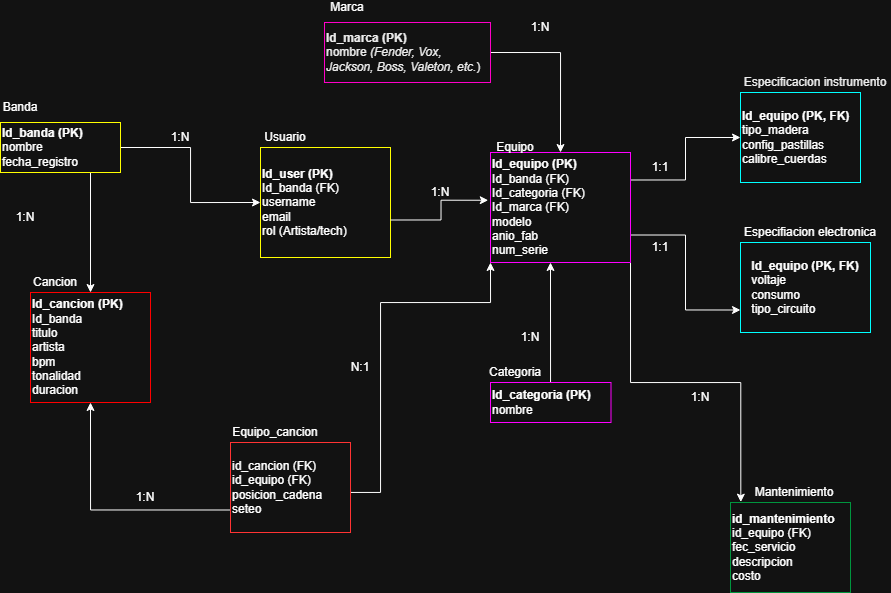

# Instrumentum

Plataforma de gestión integral de equipamiento técnico para músicos y bandas.

Instrumentum centraliza el inventario, el mantenimiento técnico y la configuración de equipamiento, optimizando el rendimiento en vivo y en estudio mediante una arquitectura de capas basada en Java Spring Boot y MySQL.

---

## Colaboradores

- Victoria Bustos
- Oscar Tavolari

---

## Índice

- [Descripción del Sistema](#descripción-del-sistema)
- [Funcionalidades](#funcionalidades)
- [Requisitos Funcionales](#requisitos-funcionales)
- [Requisitos No Funcionales](#requisitos-no-funcionales)
- [API Endpoints](#api-endpoints)
- [Modelo Entidad-Relación](#modelo-entidad-relación)
- [Stack Tecnológico](#stack-tecnológico)
- [Gestión de Riesgos](#gestión-de-riesgos)

---

## Descripción del Sistema

El sistema opera sobre una arquitectura de capas (Controller → Service → Repository) e integra los siguientes núcleos operativos:

### Gestión de Datos y Persistencia
El sistema utiliza una base de datos MySQL gestionada mediante XAMPP, donde se centraliza la información de músicos, bandas y equipamiento. La interacción con la lógica de negocio se realiza a través de peticiones HTTP documentadas en Postman.

### Ciclo de Vida del Inventario (Gear Management)
- **Segmentación por tipo:** Los instrumentos registran atributos de maderas y pastillas; los equipos electrónicos validan campos de voltaje y amperaje (mA).
- **Gestión de estados:** El sistema calcula automáticamente el tiempo transcurrido desde la última intervención técnica. Si el intervalo supera los **6 meses**, se dispara una alerta de mantenimiento preventivo.

### Módulo de Mantenimiento
Funciona como una bitácora histórica vinculada a cada activo mediante `id_equipo`. Al eliminar un equipo, sus registros de servicio asociados se eliminan en **cascada**, manteniendo la integridad referencial.

### Inteligencia del Rig Builder
Permite gestionar la relación compleja entre el repertorio y el equipamiento:
- Define un **orden lógico de conexión** (cadena de señal) para los equipos dentro de cada canción mediante la tabla `Equipo_cancion`.
- Persiste **notas de ejecución** y **seteo de perillas** por canción, funcionando como un manual técnico personalizado.

### Lógica de Cálculo Eléctrico
Al consultar el setup de una canción, el sistema **suma automáticamente los miliamperios (mA)** de todos los dispositivos activos vinculados, validando la compatibilidad con la fuente de poder.

---

## Funcionalidades

### A. Inventario con Especificaciones Técnicas
Registro detallado de equipos con atributos específicos:
- **Instrumentos:** Marca, modelo, año, tipo de madera, configuración de pastillas (pickups) y calibre de cuerdas.
- **Amplificación y pedales:** Especificaciones de voltaje (9V/12V), consumo de corriente (mA) y tipo de circuito.

### B. Módulo de Mantenimiento Preventivo
Control del ciclo de vida del equipo para evitar fallos técnicos:
- **Bitácora de servicio:** Registro de calibraciones, cambios de cuerdas y limpieza de electrónica.
- **Alertas de tiempo:** Visualización de equipos sin mantención en los últimos 6 meses.

### C. Configuración por Canción — The "Rig" Builder
Asignación de equipamiento según el repertorio:
- **Asignación de gear:** Bajo, pedalera y amplificador por tema.
- **Notas de ejecución:** Técnica (uñeta, dedos) y seteo específico de perillas por canción.

### D. Funciones Adicionales
- **Exportación de Technical Rider:** Lista de equipo automática para enviar a sonidistas o productores.
- **Calculadora de carga:** Suma el consumo (mA) de los pedales seleccionados y verifica compatibilidad con la fuente de poder.

---

## Requisitos Funcionales

- **RF-01** Gestión de Inventario de Equipos: CRUD completo. Atributos de maderas/pastillas para instrumentos; voltaje, consumo (mA) y circuito para electrónica.
- **RF-02** Módulo de Mantenimiento Preventivo: Registro de servicios por equipo. Lógica de alerta para equipos con más de 6 meses sin servicio.
- **RF-03** Configuración por Canción (Rig Builder): CRUD de canciones con asignación N:N de equipos, incluyendo orden de cadena de señal y seteo de perillas.
- **RF-04** Gestión de Usuarios y Bandas: Registro y administración de usuarios y sus agrupaciones musicales.
- **RF-05** Calculadora de Carga: Algoritmo para sumar consumo (mA) por canción y comparar contra el límite de la fuente de poder.
- **RF-06** Búsqueda y Filtros: Búsqueda por metadatos (nombre, tipo, marca) a través de parámetros de consulta en los endpoints.

---

## Requisitos No Funcionales

- **RNF-01** Tecnología: Java 21 con Spring Boot 3.4.16. Persistencia con Spring Data JPA sobre MySQL (XAMPP). Entorno de desarrollo en VS Code.
- **RNF-02** Interfaz de Pruebas: Validación de endpoints mediante Postman.
- **RNF-03** Rendimiento: Operaciones CRUD con tiempo de respuesta inferior a 2 segundos.
- **RNF-04** Seguridad de Datos: Protección contra inyección SQL nativa mediante JPA y validación de datos de entrada (Bean Validation).
- **RNF-05** Mantenibilidad: Código organizado por capas (Controller, Service, Repository) y uso de Lombok para limpieza de código.
- **RNF-06** Integridad de Datos: Eliminación en cascada para mantenimientos y restricciones de clave foránea para equipos asignados a canciones activas.

---

## API Endpoints

Base URL: `http://localhost:8181/api/v1`

### Bandas

| Método | Endpoint | Descripción | Cuerpo (ejemplo) |
|--------|----------|-------------|------------------|
| GET | `/bandas` | Lista todas las bandas (seed: "Los Solos") | – |
| GET | `/bandas/{id}` | Obtener banda por ID | – |
| POST | `/bandas` | Crear nueva banda | `{"nombre":"Banda Nueva","fechaRegistro":"2025-01-01"}` |
| PUT | `/bandas/{id}` | Actualizar banda | `{"nombre":"Actualizada","fechaRegistro":"2025-06-01"}` |
| DELETE | `/bandas/{id}` | Eliminar banda (si no tiene equipos asociados) | – |

### Usuarios

| Método | Endpoint | Descripción | Cuerpo (ejemplo) |
|--------|----------|-------------|------------------|
| GET | `/usuarios` | Listar todos los usuarios (seed: carlos_gtr, sofia_bass, pedro_sound, ana_lights) | – |
| GET | `/usuarios/{id}` | Obtener usuario por ID | – |
| GET | `/usuarios/banda/{bandaId}` | Usuarios pertenecientes a una banda | – |
| POST | `/usuarios` | Crear usuario (rol: "Musico" o "Tech") | `{"username":"nuevo","email":"nuevo@mail.com","rol":"Musico","banda":{"idBanda":1}}` |
| PUT | `/usuarios/{id}` | Actualizar usuario | `{"username":"v2","email":"v2@mail.com","rol":"Tech","banda":{"idBanda":1}}` |
| DELETE | `/usuarios/{id}` | Eliminar usuario | – |

### Marcas y Categorías

| Método | Endpoint | Descripción | Cuerpo (ejemplo) |
|--------|----------|-------------|------------------|
| GET | `/marcas` | Lista marcas (Fender, Gibson, Boss, Marshall) | – |
| GET | `/marcas/{id}` | Obtener marca por ID | – |
| POST | `/marcas` | Crear marca | `{"nombre":"PRS"}` |
| PUT | `/marcas/{id}` | Actualizar marca | `{"nombre":"PRS Guitars"}` |
| GET | `/categorias` | Lista categorías (Guitarra, Pedal, Amplificador) | – |
| GET | `/categorias/{id}` | Obtener categoría por ID | – |
| POST | `/categorias` | Crear categoría | `{"nombre":"Bajo"}` |
| PUT | `/categorias/{id}` | Actualizar categoría | `{"nombre":"Bajo Eléctrico"}` |

### Equipos (Inventario)

| Método | Endpoint | Descripción | Cuerpo (ejemplo) |
|--------|----------|-------------|------------------|
| GET | `/equipos/todos` | Lista todos los equipos (sin filtros) | – |
| GET | `/equipos/propietario/{id}` | Equipos de un usuario o banda (`propietarioId`) | – |
| GET | `/equipos/{id}` | Obtener equipo por ID | – |
| GET | `/equipos/buscar/{nombre}/{marca}/{categoria}` | Búsqueda combinada. Usar `_` como comodín. Ej: `/_/Gibson/_` | – |
| POST | `/equipos` | Crear equipo. `tipoEquipo`: INSTRUMENTO / ELECTRONICO. `tipoPropietario`: USUARIO / BANDA | `{"nombre":"Telecaster","modelo":"Player Series","marca":{"id":1},"categoria":{"id":1},"propietarioId":1,"tipoPropietario":"USUARIO","tipoEquipo":"INSTRUMENTO"}` |
| PUT | `/equipos/{id}` | Actualizar equipo | Mismo cuerpo que POST |
| DELETE | `/equipos/{id}` | Eliminar equipo (solo si no está asignado a ninguna canción) | – |

### Especificaciones Técnicas

| Método | Endpoint | Descripción | Cuerpo (ejemplo) |
|--------|----------|-------------|------------------|
| GET | `/especs/equipo/{equipoId}` | Obtener la especificación de un equipo (instrumento o electrónica) | – |
| POST | `/especs/instrumento/{equipoId}` | Agregar especificaciones de instrumento | `{"tipoMadera":"Fresno","configPastillas":"SS","calibreCuerdas":"009"}` |
| PUT | `/especs/instrumento/{equipoId}` | Actualizar especificaciones de instrumento | `{"tipoMadera":"Aliso","configPastillas":"SSS","calibreCuerdas":"010"}` |
| POST | `/especs/electronica/{equipoId}` | Agregar especificaciones electrónicas | `{"voltaje":"9V","consumo":20.0,"tipoCircuito":"Overdrive"}` |
| PUT | `/especs/electronica/{equipoId}` | Actualizar especificaciones electrónicas | `{"voltaje":"18V","consumo":25.0,"tipoCircuito":"Boost"}` |
| DELETE | `/especs/equipo/{equipoId}` | Eliminar la especificación de un equipo | – |

### Mantenimiento

| Método | Endpoint | Descripción | Cuerpo (ejemplo) |
|--------|----------|-------------|------------------|
| GET | `/mantenimientos/equipo/{equipoId}` | Historial de mantenimientos de un equipo | – |
| GET | `/mantenimientos/alerta/{equipoId}` | Retorna `{"alerta": true/false}` si necesita mantenimiento (>6 meses sin servicio) | – |
| POST | `/mantenimientos` | Registrar nuevo mantenimiento | `{"equipoId":1,"fecha":"2025-05-01","descripcion":"Ajuste y limpieza","costo":35.0}` |
| PUT | `/mantenimientos/{id}` | Actualizar un mantenimiento existente | `{"fecha":"2025-05-15","descripcion":"Nueva descripción","costo":55.0}` |
| DELETE | `/mantenimientos/equipo/{equipoId}` | Eliminar todos los mantenimientos de un equipo (transaccional) | – |

### Canciones y Rig Builder

| Método | Endpoint | Descripción | Cuerpo (ejemplo) |
|--------|----------|-------------|------------------|
| GET | `/canciones/banda/{bandaId}` | Canciones de una banda | – |
| POST | `/canciones` | Crear canción | `{"nombre":"Solo","bandaId":1,"duracionSegundos":310}` |
| PUT | `/canciones/{id}` | Actualizar canción | `{"nombre":"Nuevo nombre","duracionSegundos":340}` |
| DELETE | `/canciones/{id}` | Eliminar canción (borra en cascada las asignaciones de equipos) | – |
| POST | `/canciones/{cancionId}/equipos` | Asignar equipo a una canción con posición y seteo | `{"equipoId":1,"posicion":1,"seteoPerillas":"Volumen 7, Gain 5"}` |
| PUT | `/canciones/{cancionId}/equipos/{equipoId}` | Actualizar posición/seteo de un equipo en una canción | `{"posicion":3,"seteoPerillas":"Volumen 8, Treble 7"}` |
| DELETE | `/canciones/{cancionId}/equipos/{equipoId}` | Remover equipo de una canción | – |
| GET | `/canciones/{cancionId}/setup-completo` | Obtener el setup completo de la canción (equipos con orden y seteo) | – |
| GET | `/equipos/en-cancion/{equipoId}` | Verifica si el equipo está asignado a alguna canción (retorna `true`/`false`) | – |

---

## Modelo Entidad-Relación

El siguiente diagrama representa el modelo de datos en Tercera Forma Normal (3FN):

### Descripción de Entidades Principales

- **Banda**: Agrupación musical (`id_banda`, `nombre`, `fecha_registro`)
- **Usuario**: Músico o técnico vinculado a una banda (`username`, `email`, `tipo_perfil`)
- **Usuario_banda**: Tabla pivote que resuelve la relación N:M entre Usuario y Banda, con campo `rol`
- **Equipo**: Activo del inventario vinculado a una banda, categoría y marca
- **Categoria**: Clasificación del equipo (bajo, guitarra, pedal, etc.)
- **Marca**: Fabricante del equipo (Fender, Boss, Vox, etc.)
- **Especificacion_instrumento**: Atributos de instrumentos: `tipo_madera`, `config_pastillas`, `calibre_cuerdas`
- **Especificacion_electronica**: Atributos eléctricos: `voltaje`, `consumo` (mA), `tipo_circuito`
- **Mantenimiento**: Bitácora de servicios técnicos: `fec_servicio`, `descripcion`, `costo`
- **Cancion**: Tema del repertorio con `bpm`, `tonalidad`, `duracion`, entre otros
- **Equipo_cancion**: Tabla pivote N:M que define `posicion_cadena` y `seteo` de cada equipo en una canción

---

## Stack Tecnológico

| Capa | Tecnología |
|------|-----------|
| Lenguaje | Java 21 |
| Framework | Spring Boot 3.4.16 |
| Persistencia | Spring Data JPA |
| Base de Datos | MySQL (XAMPP) |
| Validación | Bean Validation (Jakarta) |
| Utilidades | Lombok |
| Testing de API | Postman |
| IDE | Visual Studio Code |

---

## Gestión de Riesgos

### Riesgos Críticos (Impacto Alto)

**R01 — Incompatibilidad de Versión (Spring Boot)**
- **Categoría:** Técnico
- **Probabilidad:** Media | **Impacto:** Alto
- **Mitigación:** Realizar una prueba de concepto (PoC) para validar que las dependencias de Jakarta Persistence y el driver de MySQL operen sin conflictos en la versión de Spring utilizada.

**R02 — Desconexión del Motor de Base de Datos (MySQL/XAMPP)**
- **Categoría:** Infraestructura Local
- **Probabilidad:** Media | **Impacto:** Alto
- **Mitigación:** Configurar un `HealthCheck` en Spring para monitorear el estado de la conexión y asegurar que el servicio MySQL en XAMPP esté activo antes del despliegue del `.jar`.

**R03 — Brecha de Seguridad en Aislamiento de Datos**
- **Categoría:** Seguridad
- **Probabilidad:** Baja | **Impacto:** Crítico
- **Mitigación:** Implementar cláusulas `WHERE user_id = :current_user` en todos los métodos del repositorio JPA para evitar que un usuario acceda al inventario de otro.

### Riesgos Moderados (Impacto Medio)

**R04 — Error en Algoritmo de Cálculo de Carga (RF-05)**
- **Categoría:** Funcional
- **Probabilidad:** Baja | **Impacto:** Medio
- **Mitigación:** Desarrollar una suite de pruebas unitarias con JUnit 5 que cubra casos borde (pedales sin amperaje definido, sumas que exceden el límite de la fuente).

**R05 — Inconsistencia por Eliminación en Cascada**
- **Categoría:** Integridad de Datos
- **Probabilidad:** Baja | **Impacto:** Alto
- **Mitigación:** Aplicar `@OnDelete(action = OnDeleteAction.CASCADE)` únicamente en los logs de mantenimiento, protegiendo con restricciones de clave foránea los equipos vinculados a canciones activas.

### Riesgos Operacionales (Impacto Bajo)

**R07 — Fallas en Generación de Technical Rider**
- **Categoría:** Funcional
- **Probabilidad:** Media | **Impacto:** Medio
- **Mitigación:** Validar los campos de texto antes de la exportación para evitar caracteres especiales que corrompan el formato del archivo final (PDF/Texto).

---

*Instrumentum — Gestión técnica de equipamiento musical*